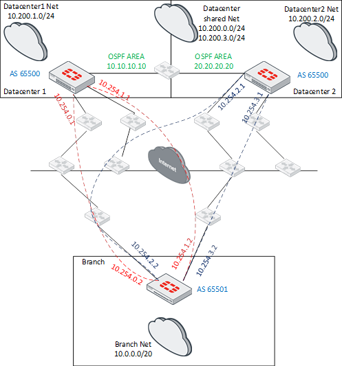

# SD-WAN: Single Hub

This deployment reference will provide you all steps required to implement
a Single Hub SD-WAN configuration.

## Network Diagram




## Requirements and Assumptions

- Lorem Ipsum
- Lorem Ipsum


## Architecture and Components

- FortiManager (Orchestrationd and Management)
- FortiGate (Controller and Data)


## Features and Capabilities

- Dynamic Routing (BGP)
- Direct Internet Access (DIA)
- ADVPN


## Configuration Overview

These are the main configuration steps required to deploy this architecture.

1. VPNs
2. Interfaces
3. BGP
4. Firewall Policies


## Configuration Guide

### Basic Management

We will start our deployment by importing all existing devices on the
environment to FortiManager, moving those devices to specific device
groups to improve organization, creating meta fields that will be used
to differentiate those devices during the deployment of scripts,
creating dynamic interfaces to allow us to use a single policy package
for all branches.

#### 1. Add devices to FortiManager

=== "FortiManager GUI"

    <iframe width="560" height="315" src="https://www.youtube.com/embed/SFBd8pMhw1s" frameborder="0" allow="accelerometer; autoplay; clipboard-write; encrypted-media; gyroscope; picture-in-picture" allowfullscreen></iframe>

=== "FortiOS GUI"

    <iframe width="560" height="315" src="https://www.youtube.com/embed/qmcrbomk4CQ" frameborder="0" allow="accelerometer; autoplay; clipboard-write; encrypted-media; gyroscope; picture-in-picture" allowfullscreen></iframe>

=== "FortiOS CLI"

    ```
    config system central-management
        set type fortimanager
        set fmg "10.100.55.12"
    end
    ```

=== "FortiManager API"
 
    ???+ question "REQUEST"

        ```json
        {
            "id": 1,
            "jsonrpc": "1.0",
            "method": "exec",
            "params": [{
                "data": {
                    "adom": "DEMO",
                    "package": "default",
                    "script": "script-002"
                },
                "url": "/dvmdb/adom/DEMO/script/execute"
            }],
            "session": "tWy6iKRmT+C2obiyVpAz6c0tSel3RnNroUhqIeko0SLQD0lz1dSJ5iB0XbW4DcTb/w/bFkt6XuLLSz5AkyA9UA==",
            "verbose": 1
        }
        ```

    ???+ success "RESPONSE"

        ```json
        {
            "id": 1,
            "result": [{
                "data": {
                    "task": 452
                },
                "status": {
                    "code": 0,
                    "message": "OK"
                },
                "url": "/dvmdb/adom/DEMO/script/execute"
            }]
        }
        ```

=== "FortiManager Ansible"

    ```yaml
    - name: Probe a remote device and retrieve its device information and system status
      fortinet.fortimanager.fmgr_dvm_cmd_discover_device:
        dvm_cmd_discover_device:
          device:
            adm_usr: '{{ adm_usr }}'
            adm_pass: '{{ adm_pass }}'
            ip: '{{ item.device_ip }}'
      register: result

    - name: Add a device to the Device Manager database
      fortinet.fortimanager.fmgr_dvm_cmd_add_device:
        bypass_validation: True
        dvm_cmd_add_device:
          adom: '{{ adom }}'
          device:
            adm_usr: '{{ adm_usr }}'
            adm_pass: '{{ adm_pass }}'
            ip: '{{ item.device_ip }}'
            name: '{{ item.device_name }}'
            mgmt_mode: fmg
            sn: '{{ result.meta.response_data.device.sn }}'
          flags:
              - create_task
              - nonblocking
      register: installing_task

    - name: poll the task
      fortinet.fortimanager.fmgr_fact:
        facts:
            selector: task_task
            params:
                task: '{{ installing_task.meta.response_data.taskid }}'
      register: taskinfo
      until: taskinfo.meta.response_data.percent == 100
      retries: 30
      delay: 5
      failed_when: taskinfo.meta.response_data.state == 'error' and 'devsnexist' not in taskinfo.meta.response_data.line[0].detail
    ```

    !!! warning
        If poll task is not used it can lead to this error due to timeout:
        ```
        Traceback (most recent call last):
            File "/root/.ansible/tmp/ansible-local-3828ckgvd40u/ansible-tmp-1597342626.9736748-3875-19826767949616/AnsiballZ_fmgr_dvm_cmd_add_device.py", line 102, in <module>
            _ansiballz_main()
            File "/root/.ansible/tmp/ansible-local-3828ckgvd40u/ansible-tmp-1597342626.9736748-3875-19826767949616/AnsiballZ_fmgr_dvm_cmd_add_device.py", line 94, in _ansiballz_main
            invoke_module(zipped_mod, temp_path, ANSIBALLZ_PARAMS)
            File "/root/.ansible/tmp/ansible-local-3828ckgvd40u/ansible-tmp-1597342626.9736748-3875-19826767949616/AnsiballZ_fmgr_dvm_cmd_add_device.py", line 40, in invoke_module
            runpy.run_module(mod_name='ansible_collections.fortinet.fortimanager.plugins.modules.fmgr_dvm_cmd_add_device', init_globals=None, run_name='__main__', alter_sys=True)
            File "/usr/lib/python3.7/runpy.py", line 205, in run_module
            return _run_module_code(code, init_globals, run_name, mod_spec)
            File "/usr/lib/python3.7/runpy.py", line 96, in _run_module_code
            mod_name, mod_spec, pkg_name, script_name)
            File "/usr/lib/python3.7/runpy.py", line 85, in _run_code
            exec(code, run_globals)
            File "/tmp/ansible_fortinet.fortimanager.fmgr_dvm_cmd_add_device_payload_4h897igx/ansible_fortinet.fortimanager.fmgr_dvm_cmd_add_device_payload.zip/ansible_collections/fortinet/fortimanager/plugins/modules/fmgr_dvm_cmd_add_device.py", line 362, in <module>
            File "/tmp/ansible_fortinet.fortimanager.fmgr_dvm_cmd_add_device_payload_4h897igx/ansible_fortinet.fortimanager.fmgr_dvm_cmd_add_device_payload.zip/ansible_collections/fortinet/fortimanager/plugins/modules/fmgr_dvm_cmd_add_device.py", line 356, in main
        ansible_collections.fortinet.fortimanager.plugins.module_utils.common.FMGBaseException: command timeout triggered, timeout value is 30 secs.
        See the timeout setting options in the Network Debug and Troubleshooting Guide.
        ```

#### 2. Add devices to group

stuff stuff stuff